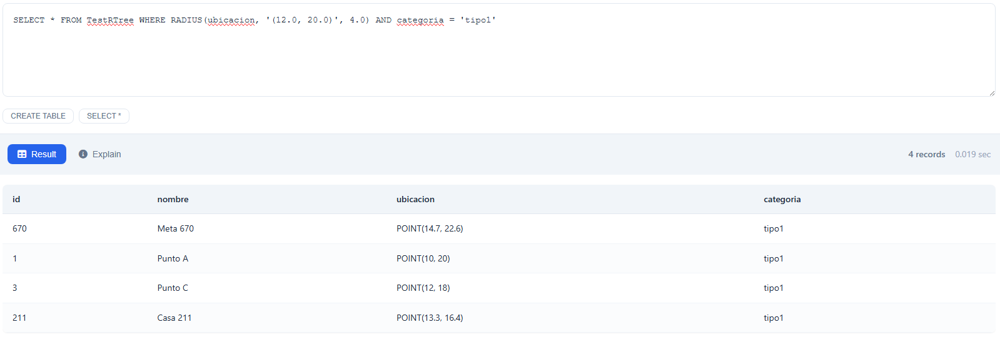

# Base de Datos con Técnicas de Indexación
https://drive.google.com/file/d/1_zdYkNr2rqi7TuDD37E-kWZs40Oy0blN/view?usp=sharing
## Introducción

Este proyecto implementa un sistema de gestión de bases de datos que utiliza diferentes técnicas de indexación para optimizar la gestión, almacenamiento y recuperación de datos. El sistema está desarrollado en **Python** y permite comparar la eficiencia de distintas estructuras de datos para operaciones de base de datos, incluyendo **indexación espacial** para datos geográficos.

## Objetivos

**Implementar y comparar técnicas de indexación:**

- **B+ Tree**: Estructura balanceada optimizada para sistemas de archivos  
- **AVL Tree**: Árbol binario auto-balanceado  
- **Extendible Hashing**: Técnica de hashing dinámico
- **R-Tree**: Índice espacial para datos multidimensionales y geográficos

**Operaciones implementadas para cada técnica:**

- Búsqueda específica (`Search`)
- Búsqueda por rango (`Range Search`)
- Inserción de registros (`Insert`)
- Eliminación de registros (`Remove`)
- **Búsquedas espaciales** (`Radius Search`, `K-Nearest Neighbors`) - **exclusivo R-Tree**

**Análisis de rendimiento:**

- Comparación de tiempos de ejecución  
- Evaluación de eficiencia en diferentes volúmenes de datos  
- Medición de complejidad temporal y espacial
- **Benchmarks específicos para consultas espaciales**

## Técnicas de Indexación Implementadas

### 1. B+ Tree (Unclustered)

Estructura de datos balanceada especialmente diseñada para sistemas de almacenamiento que requieren acceso secuencial eficiente y operaciones de rango optimizadas.

**Características:**

- Todos los datos se almacenan en las hojas  
- Nodos internos solo contienen claves de navegación  
- Hojas enlazadas para facilitar recorridos secuenciales  
- **Complejidad**: `O(log_m n)` para búsqueda, inserción y eliminación

### 2. AVL Tree

Árbol binario de búsqueda auto-balanceado que mantiene la diferencia de alturas entre subárboles en máximo 1.

**Características:**

- Balanceo automático mediante rotaciones  
- Búsquedas eficientes en tiempo logarítmico  
- Ideal para aplicaciones con muchas operaciones de búsqueda  
- **Complejidad**: `O(lg n)` para todas las operaciones básicas

### 3. Extendible Hashing

Técnica de hashing dinámico que permite el crecimiento incremental del espacio de direcciones.

**Características:**

- Directorio de buckets que puede duplicarse dinámicamente  
- No requiere reorganización completa al crecer  
- Eficiente para grandes volúmenes de datos  
- **Complejidad**: `O(1)` promedio para búsqueda e inserción 

### 4. R-Tree (Spatial Index)  

Estructura de datos espacial especializada para indexar información geográfica y multidimensional, optimizada para consultas de proximidad y área.

**Características:**

- **Índice espacial 2D** para datos de tipo POINT  
- **Bounding boxes jerárquicos** que agrupan regiones similares  
- **Variante R*-tree** con optimizaciones de inserción y división  
- **Búsquedas por radio** eficientes usando geometría euclidiana  
- **K-vecinos más cercanos** con algoritmos de distancia  
- **Persistencia en archivos** `.dat` e `.idx` usando librería rtree  
- **Complejidad**: `O(log n)` para búsquedas espaciales, `O(log n + k)` para consultas de rango

**Operaciones Espaciales Únicas:**

- `rangeSearch(point, radius)` - Encuentra puntos dentro de un radio
- `rangeSearch(point, k)` - Encuentra los k puntos más cercanos  
- `rangeSearch(min_point, max_point)` - Búsqueda rectangular tradicional

## Estructura del Proyecto

```
BD2/
├── main.py                 # API FastAPI - Punto de entrada principal
├── sql.py                  # Gestor SQL - Parser y ejecución de comandos
├── tabla.py                # Gestor de almacenamiento de tablas
├── README.md              # Documentación del proyecto
│
├── estructuras/           # Estructuras de datos e indexación
│   ├── avl.py            # Implementación del AVL Tree
│   ├── btree.py          # Implementación del B+ Tree
│   ├── hash.py           # Implementación del Extendible Hashing
│   ├── rtreee .py        # Implementación del R-Tree espacial  
│   └── point_class.py    # Clase Point para manejo de coordenadas 2D
│
├── tablas/               # Directorio de archivos de datos
│   ├── *.bin            # Archivos binarios de tablas
│   └── *_meta.json      # Metadatos de tablas
│
└── indices/              # Directorio de archivos de índices
    ├── *_avl.dat        # Índices AVL
    ├── *_tree.dat       # Índices B+ Tree
    ├── *_meta.dat       # Metadatos de índices B+ Tree
    ├── *_index.dat      # Índices Hash - Directorio
    ├── *_buckets.dat    # Índices Hash - Buckets
    ├── *_rtree.dat      # Índices R-Tree - Datos espaciales  
    ├── *_rtree.idx      # Índices R-Tree - Estructura del árbol  
    └── *_rtree_meta.json # Metadatos R-Tree  
```

## Componentes Principales

### 1. **API REST (main.py)**
- Servidor FastAPI que expone endpoints HTTP
- Ejecuta comandos SQL a través de requests POST
- Soporta CORS para integración con frontend
- Manejo de serialización de tipos especiales (Point)
- **Serialización automática de resultados espaciales**

### 2. **Parser SQL (sql.py)**
- Interpreta comandos SQL estándar: CREATE, INSERT, SELECT, DELETE
- Soporte para importación desde CSV
- Manejo de tipos de datos: INT, DECIMAL, VARCHAR, BOOL, DATE, POINT
- Procesamiento de condiciones WHERE con rangos y comparaciones
- **Parser de funciones espaciales: RADIUS() y KNN()**  

### 3. **Gestor de Tablas (tabla.py)**
- Almacenamiento eficiente en archivos binarios
- Lista libre para reutilización de registros eliminados
- Gestión automática de índices múltiples por tabla
- Validación y conversión de tipos de datos
- **Detección automática de índices R-Tree espaciales**  
- **Integración de búsquedas espaciales con consultas regulares**  

### 4. **Estructuras de Indexación**

#### **AVL Tree (avl.py)**
- Árbol binario auto-balanceado
- Rotaciones automáticas para mantener balance
- Soporte para claves duplicadas y únicas
- Búsquedas exactas y por rango

#### **B+ Tree (btree.py)**
- Estructura optimizada para almacenamiento en disco
- Hojas enlazadas para recorridos secuenciales
- Persistencia automática en archivos .dat
- Soporte completo para rangos

#### **Extendible Hashing (hash.py)**
- Hashing dinámico con crecimiento incremental
- Manejo de overflow con buckets enlazados
- Ideal para búsquedas exactas O(1)
- No soporta búsquedas por rango

#### **R-Tree (rtreee.py)**  
- **Índice espacial 2D** basado en librería rtree de Python
- **R*-tree variant** con optimizaciones avanzadas
- **Cache inteligente** de objetos Point para rendimiento
- **Bounding boxes dinámicos** que se ajustan automáticamente
- **Persistencia dual** en archivos .dat e .idx
- **Buffer management** para operaciones masivas
- **Detección automática** de registros con coordenadas POINT

### 5. **Tipo de Dato POINT (point_class.py)**
- Representa coordenadas 2D (x, y)
- Operaciones matemáticas sobrecargadas
- Comparaciones basadas en distancia al origen
- Búsquedas rectangulares para rangos
- **Parsing automático desde strings** `"(x, y)"`  
- **Cálculos de distancia euclidiana** para R-Tree  
- **Verificación de pertenencia a regiones** rectangulares y circulares  

## Tipos de Datos Soportados

| Tipo | Descripción | Ejemplo | Índices Compatibles |
|------|-------------|---------|-------------------|
| `INT` | Números enteros | `42` | AVL, B+Tree, Hash |
| `DECIMAL` | Números decimales | `3.14159` | AVL, B+Tree, Hash |
| `VARCHAR[n]` | Cadenas de longitud variable | `'Texto'` | AVL, B+Tree, Hash |
| `CHAR[n]` | Cadenas de longitud fija | `'ABC'` | AVL, B+Tree, Hash |
| `BOOL` | Valores booleanos | `true`, `false` | AVL, B+Tree, Hash |
| `DATE` | Fechas como timestamp | `1640995200` | AVL, B+Tree, Hash |
| `POINT` | **Coordenadas 2D** | `(1.5, 2.3)` | **R-Tree**   |

## Comandos SQL Soportados

### CREATE TABLE
```sql
CREATE TABLE Productos (
    id INT KEY INDEX btree,
    nombre VARCHAR[50] INDEX avl,
    precio DECIMAL INDEX hash,
    ubicacion POINT INDEX rtree    --   Índice espacial
);
```

### INSERT
```sql
INSERT INTO Productos VALUES (1, 'Laptop', 999.99, '(10.5, 20.3)');

-- Formatos soportados para POINT:
INSERT INTO Restaurantes VALUES 
(1, 'Pizza Hut', '(12.5, 25.3)'),     -- Formato estándar
(2, 'McDonald''s', '12.0, 18.5'),     -- Sin paréntesis  
(3, 'KFC', '(15.2,30.1)');            -- Sin espacios
```

### SELECT

#### **Búsquedas Tradicionales**
```sql
-- Búsqueda exacta
SELECT * FROM Productos WHERE id = 1;

-- Búsqueda por rango
SELECT nombre, precio FROM Productos WHERE precio BETWEEN 100 AND 1000;

-- Búsqueda de puntos en área rectangular
SELECT * FROM Productos WHERE ubicacion BETWEEN '(0, 0)' AND '(50, 50)';
```

#### **  Búsquedas Espaciales con R-Tree**
```sql
-- Búsqueda por radio: encontrar puntos dentro de 5km del centro (12, 22)
SELECT * FROM Restaurantes WHERE RADIUS(ubicacion, '(12.0, 22.0)', 5.0);

-- K-vecinos más cercanos: encontrar los 3 restaurantes más cercanos
SELECT nombre, ubicacion FROM Restaurantes WHERE KNN(ubicacion, '(10.0, 20.0)', 3);

-- Combinación de búsquedas espaciales y tradicionales
SELECT * FROM Restaurantes 
WHERE RADIUS(ubicacion, '(15.0, 25.0)', 10.0) AND precio < 50.0;

-- Múltiples condiciones espaciales
SELECT * FROM Puntos 
WHERE KNN(ubicacion, '(0, 0)', 5) AND categoria = 'importante';
```

### DELETE

#### **Eliminación Tradicional**
```sql
DELETE FROM Productos WHERE precio > 500;
```

#### **  Eliminación Espacial**
```sql
-- Eliminar puntos en un área específica
DELETE FROM Restaurantes WHERE RADIUS(ubicacion, '(10.0, 20.0)', 5.0);

-- Eliminar el punto más cercano a una ubicación
DELETE FROM Puntos WHERE KNN(ubicacion, '(25.0, 30.0)', 1);
```

### IMPORT FROM CSV
```sql
IMPORT FROM CSV 'restaurantes.csv' INTO Restaurantes;
-- El CSV puede contener columnas POINT que se convierten automáticamente
```

## Instalación y Uso

### Requisitos
- Python 3.8+
- FastAPI
- Uvicorn
- Pydantic
- **rtree** (para índices espaciales)  
- **libspatialindex** (dependencia de rtree)  

### Ejemplo de Request Espacial  
```json POST /sql
{
    "sql": "CREATE TABLE Tiendas (id INT KEY INDEX btree, nombre VARCHAR[100], ubicacion POINT INDEX rtree); INSERT INTO Tiendas VALUES (1, 'Centro Comercial', '(12.5, 25.3)'); SELECT * FROM Tiendas WHERE RADIUS(ubicacion, '(12.0, 25.0)', 2.0);"
}
```

## Características Especiales

###   **Consultas Espaciales Avanzadas**
- **Búsquedas por proximidad** con radio personalizable
- **K-vecinos más cercanos** con algoritmos optimizados  
- **Combinación de filtros** espaciales y alfanuméricos
- **Intersección eficiente** de múltiples condiciones espaciales

###  **Manejo Avanzado de Tipos**
- Conversión automática de tipos en CSV
- Serialización JSON de objetos Point
- Validación estricta de tipos de datos
- **Parsing robusto de coordenadas** desde múltiples formatos  

### **Optimización de Consultas**
- Intersección eficiente de múltiples condiciones
- Optimización de búsquedas por rango
- **Cache inteligente para consultas espaciales repetitivas**  
- **Detección automática del tipo de índice óptimo**  

###  **Persistencia Robusta**
- Archivos binarios optimizados
- Metadatos JSON para estructura
- Recovery automático de índices
- **Persistencia dual para R-Tree** (.dat + .idx)  
- **Compresión automática de índices espaciales**  

### **Análisis de Rendimiento**
- Tiempos de ejecución por operación
- Estadísticas de uso de índices
- Métricas de almacenamiento
- **Benchmarks específicos para operaciones espaciales**  
- **Análisis de distribución geográfica de datos**  


## Comparación de Técnicas

| Operación | AVL Tree | B+ Tree | Hash | **R-Tree** |
|-----------|----------|---------|------|------------|
| **Búsqueda Exacta** | O(log n) | O(log n) | O(1) | **O(log n)** |
| **Búsqueda Rango** | O(log n + k) | O(log n + k) | ❌ | **O(log n + k)** |
| **Búsqueda Espacial** | ❌ | ❌ | ❌ | **O(log n + k)** |
| **Radio Search** | ❌ | ❌ | ❌ | **O(log n + k)** |
| **K-NN Search** | ❌ | ❌ | ❌ | **O(log n + k)** |
| **Inserción** | O(log n) | O(log n) | O(1) | **O(log n)** |
| **Eliminación** | O(log n) | O(log n) | O(1) | **O(log n)** |
| **Espacio** | Medio | Alto | Bajo | **Medio-Alto** |
| **Datos Soportados** | 1D ordenables | 1D ordenables | 1D hasheables | **2D espaciales** |
| **Uso Recomendado** | Búsquedas mixtas | Rangos frecuentes | Búsquedas exactas | **Consultas geográficas** |


# Análisis Experimental: Comparación de Eficiencia de Índices

## Configuración del Experimento

**Dataset:** PerformanceTest con 5,000 registros sintéticos  
**Tipos de Índice:** Hash, AVL, B+Tree, Sin Índice  
**Métricas:** Tiempo de ejecución (ms), Registros encontrados, Eficiencia relativa  

---


# Análisis Experimental: Comparación de Eficiencia de Índices

## Configuración del Experimento

### Dataset Utilizado
**Tabla:** PerformanceTest con **5,000 registros sintéticos** generados automáticamente  
**Fuente:** medium_dataset.csv (5K registros)  
**Tipos de Índice:** Hash, AVL, B+Tree, Sin Índice  
**Métricas:** Tiempo de ejecución (ms), Registros encontrados, Eficiencia relativa  


### Código SQL de Configuración
```sql
-- Creación de la tabla con múltiples tipos de índices
CREATE TABLE PerformanceTest (
    id VARCHAR[5] KEY INDEX hash,           -- Primary Key con Hash (búsquedas exactas O(1))
    edad_avl INT INDEX avl,                 -- AVL para comparar con B+Tree en rangos
    edad_btree INT INDEX btree,             -- B+Tree para comparar con AVL en rangos  
    nombre_completo VARCHAR[50],            -- SIN ÍNDICE para mostrar diferencia
    ciudad VARCHAR[20] INDEX hash,          -- Hash para búsquedas exactas por ciudad
    profesion VARCHAR[20] INDEX btree,      -- B+Tree para ordenar y agrupar profesiones
    telefono VARCHAR[15],                   -- SIN ÍNDICE
    email VARCHAR[50],                      -- SIN ÍNDICE  
    salario INT INDEX btree,                -- B+Tree para consultas de rangos salariales
    fecha_nacimiento VARCHAR[12] INDEX avl, -- AVL para fechas (orden cronológico)
    codigo_postal INT INDEX hash,           -- Hash para búsquedas exactas por zona
    puntuacion DECIMAL INDEX btree,         -- B+Tree para rangos de puntuación
    estado_civil VARCHAR[15] INDEX hash,    -- Hash para agrupaciones rápidas
    nivel_educacion VARCHAR[15]             -- SIN ÍNDICE para comparación
);

-- Importación del dataset de 5,000 registros
IMPORT FROM CSV 'medium_dataset.csv' INTO PerformanceTest;

```
Los datos son diferentes en avl y btree 

### Estructura del Dataset
- **Registros totales:** 5,000 
- **Distribución de índices:**
  - **4 índices Hash:** id (PK), ciudad, codigo_postal, estado_civil
  - **2 índices AVL:** edad_avl, fecha_nacimiento  
  - **4 índices B+Tree:** edad_btree, profesion, salario, puntuacion
  - **4 campos sin índice (AVL por defecto):** nombre_completo, telefono, email, nivel_educacion  

---

## 1. PRUEBAS DE BÚSQUEDA EXACTA

### Objetivo: Evaluar eficiencia en búsquedas de valores específicos

#### 1.1 Búsquedas con Índice Hash (O(1) esperado)

| Consulta | Campo | Tipo Índice | Tiempo (s) | Registros | Observaciones |
|----------|-------|-------------|-------------|-----------|---------------|
| `SELECT * FROM PerformanceTest WHERE id = 'R95BJ'` | id | Hash (PK) | 0.004| 1| |
| `SELECT * FROM PerformanceTest WHERE ciudad = 'Madrid'` | ciudad | Hash |0.037 |214 | |
 
#### 1.4 Búsquedas Sin Índice (O(n) esperado - Baseline)

| Consulta | Campo | Tipo Índice | Tiempo (s) | Registros | Observaciones |
|----------|-------|-------------|-------------|-----------|---------------|
| `SELECT * FROM PerformanceTest WHERE nombre_completo = 'Ana García'` | nombre_completo | Sin índice | 0.320| 5| |
| `SELECT * FROM PerformanceTest WHERE telefono = '637358986';` | telefono | Sin índice |0.011 | 1| |
| `SELECT * FROM PerformanceTest WHERE email = 'isabel.morales@yahoo.es' ;` | email | Sin índice | 0.015 | 3| |

---

## 2. PRUEBAS DE BÚSQUEDA POR RANGO

### Objetivo: Comparar AVL vs B+Tree en consultas de rango


| Consulta | Índice | Tiempo (s) | Registros | Eficiencia |
|----------|--------|-------------|-----------|------------|
| `SELECT * FROM PerformanceTest WHERE edad_avl BETWEEN 20 AND 40` | AVL | 0.3 | 1564 | |
| `SELECT * FROM PerformanceTest WHERE edad_btree BETWEEN 20 AND 40` | B+Tree | 0.263 | 1610| |

| Consulta | Índice | Tiempo (s) | Registros | Eficiencia |
|----------|--------|-------------|-----------|------------|
| `SELECT * FROM PerformanceTest WHERE edad_avl BETWEEN 18 AND 65` | AVL | 0.696| 3621| |
| `SELECT * FROM PerformanceTest WHERE edad_btree BETWEEN 18 AND 65` | B+Tree | 0.619|3690 | |

---

## PRUEBAS DE CONSULTAS COMPLEJAS

| Consulta | Índices Utilizados | Tiempo (s) | Registros | Observaciones |
|----------|-------------------|-------------|-----------|---------------|
| `SELECT * FROM PerformanceTest WHERE ciudad = 'Madrid' AND edad_avl > 30` | Hash + AVL |0.751  | 164| |


# Análisis Experimental: Comparación AVL vs B+Tree para Datos Espaciales (POINT)

## Configuración del Experimento TestFix

### Dataset Utilizado
**Tabla:** TestFix con **1,004 registros** (1,000 registros generados + 4 registros iniciales)  
**Fuente:** testfix_1k_data.csv + registros iniciales  
**Tipos de Índice:** AVL, B+Tree, Hash  
**Tipo de Dato Especial:** POINT (coordenadas 2D)  

### Código SQL de Configuración
```sql
-- Creación de la tabla con índices espaciales
CREATE TABLE TestFix (
    id INT PRIMARY KEY INDEX avl,
    nombre VARCHAR[15] INDEX hash,
    punto_avl POINT INDEX avl,
    punto_btree POINT INDEX btree
);

-- Importación del dataset de 1,000 registros espaciales
IMPORT FROM CSV 'testfix_1k_data.csv' INTO TestFix;
```

### Estructura del Dataset
- **Registros totales:** 1,004
- **Registros de prueba:** 1,000 (IDs 8-1007)  
- **Distribución de índices:**
  - **1 índice AVL:** id (Primary Key)
  - **1 índice Hash:** nombre  
  - **1 índice AVL:** punto_avl (datos espaciales POINT)
  - **1 índice B+Tree:** punto_btree (datos espaciales POINT)
- **Características especiales:**
  - punto_avl = punto_btree (valores idénticos para comparación directa)
  - Coordenadas en formato "(x, y)" 
  - Rango de coordenadas: -10.0 a 10.0

---


## 1. PRUEBAS DE BÚSQUEDA ESPACIAL POR RANGO

### Objetivo: Comparar AVL vs B+Tree en consultas de área rectangular

#### 1.1 Rangos Pequeños (área cercana al origen)

| Consulta | Índice | Tiempo (s) | Registros | Eficiencia |
|----------|--------|-------------|-----------|------------|
| `SELECT * FROM TestFix WHERE punto_avl BETWEEN '(-1.0, -1.0)' AND '(1.0, 1.0)'` | AVL | 0.120 | 145| Área 2x2 centrada en origen |
| `SELECT * FROM TestFix WHERE punto_btree BETWEEN '(-1.0, -1.0)' AND '(1.0, 1.0)'` | B+Tree | 0.464| 145| Misma área, índice B+Tree |
| `SELECT * FROM TestFix WHERE punto_avl BETWEEN '(-0.5, -0.5)' AND '(0.5, 0.5)'` | AVL | 0.114| 72 | Área 1x1 muy pequeña |
| `SELECT * FROM TestFix WHERE punto_btree BETWEEN '(-0.5, -0.5)' AND '(0.5, 0.5)'` | B+Tree |0.166 | 72 | Misma área pequeña |

#### 1.2 Rangos Medianos (cuadrantes completos)

| Consulta | Índice | Tiempo (s) | Registros | Eficiencia |
|----------|--------|-------------|-----------|------------|
| `SELECT * FROM TestFix WHERE punto_avl BETWEEN '(0.0, 0.0)' AND '(5.0, 5.0)'` | AVL |0.118 | 146| Cuadrante I parcial |
| `SELECT * FROM TestFix WHERE punto_btree BETWEEN '(0.0, 0.0)' AND '(5.0, 5.0)'` | B+Tree | 0.162| 146| Misma área, B+Tree |
| `SELECT * FROM TestFix WHERE punto_avl BETWEEN '(-5.0, -5.0)' AND '(0.0, 0.0)'` | AVL | 0.121| 143| Cuadrante III parcial |
| `SELECT * FROM TestFix WHERE punto_btree BETWEEN '(-5.0, -5.0)' AND '(0.0, 0.0)'` | B+Tree |0.168  |143 | Misma área, B+Tree |

#### 1.3 Rangos Grandes (área completa del dataset)

| Consulta | Índice | Tiempo (s) | Registros | Eficiencia |
|----------|--------|-------------|-----------|------------|
| `SELECT * FROM TestFix WHERE punto_avl BETWEEN '(-10.0, -10.0)' AND '(10.0, 10.0)'` | AVL | 0.187|1004 | Área completa del dataset |
| `SELECT * FROM TestFix WHERE punto_btree BETWEEN '(-10.0, -10.0)' AND '(10.0, 10.0)'` | B+Tree | 0.246| 1004| Misma área completa |
---

## 3. PRUEBAS DE CONSULTAS ESPACIALES COMPLEJAS

### Objetivo: Evaluar combinación de índices espaciales y alfanuméricos

| Consulta | Índices Utilizados | Tiempo (s) | Registros | Observaciones |
|----------|-------------------|-------------|-----------|---------------|
| `SELECT * FROM TestFix WHERE id > 500 AND punto_btree BETWEEN '(0.0, 0.0)' AND '(3.0, 3.0)'` | AVL + B+Tree |0.512  | 65| Filtro por ID + área espacial |
| `SELECT * FROM TestFix WHERE punto_avl BETWEEN '(-2.0, -2.0)' AND '(2.0, 2.0)' AND punto_btree BETWEEN '(-2.0, -2.0)' AND '(2.0, 2.0)'  AND id < 100` | AVL + B+Tree |0.272  | 19| Verificación de igualdad |

---


# Análisis Experimental: R-Tree para Búsquedas Espaciales

## Configuración del Experimento R-Tree

### Dataset Utilizado y Estructura

-- Creación de la tabla con índice R-Tree espacial
CREATE TABLE TestRTree (
    id INT PRIMARY KEY,
    nombre VARCHAR[30],
    ubicacion POINT INDEX rtree,
    categoria VARCHAR[20]
);

800 datos cargados

## 1. PRUEBAS DE BÚSQUEDA POR RADIO (RADIUS)

### Objetivo: Evaluar eficiencia de búsquedas circulares R-Tree
 
| Consulta | Centro | Radio | Tiempo (s) | Registros | Puntos Encontrados |
|----------|--------|-------|-------------|-----------|-------------------|
| `SELECT * FROM TestRTree WHERE RADIUS(ubicacion, '(12.0, 22.0)', 5.0)` | (12.0, 22.0) | 5.0 | 0.005 | 21|  |
| `SELECT * FROM TestRTree WHERE RADIUS(ubicacion, '(10.0, 20.0)', 3.0)` | (10.0, 20.0) | 3.0 |0.004 | 8| |
| `SELECT * FROM TestRTree WHERE RADIUS(ubicacion, '(15.0, 25.0)', 26.0)` | (15.0, 25.0) | 2.0 |0.020  | 230|  |
| `SELECT * FROM TestRTree WHERE RADIUS(ubicacion, '(0.0, 0.0)', 50.0)` | (0.0, 0.0) | 50.0 | 0.058  | 780| |


---

## 2. PRUEBAS DE BÚSQUEDA K-NN (K VECINOS MÁS CERCANOS)

### Objetivo: Evaluar eficiencia de búsquedas de proximidad R-Tree

| Consulta | Centro | K | Tiempo (s) | Registros | Puntos Esperados|
|----------|--------|---|-------------|-----------|-------------------------|
| `SELECT * FROM TestRTree WHERE KNN(ubicacion, '(11.0, 19.0)', 2)` | (11.0, 19.0) | 2 |0.314 |2 | A, C (más cercanos) |
| `SELECT * FROM TestRTree WHERE KNN(ubicacion, '(12.0, 22.0)', 1)` | (12.0, 22.0) | 1 |0.005 | 1| A (más cercano) |
| `SELECT * FROM TestRTree WHERE KNN(ubicacion, '(15.0, 25.0)', 30)` | (15.0, 25.0) | 3 |0.007 | 30| B, A, C, ... (30más cercanos) |
| `SELECT nombre, ubicacion FROM TestRTree WHERE KNN(ubicacion, '(8.0, 22.0)', 400)` | (8.0, 22.0) | 4 | 0.031| 400| D, A, C, B ,. .. (400 ) |


## 3. PRUEBAS DE CONSULTAS ESPACIALES COMPLEJAS

### Objetivo: Evaluar combinación de filtros espaciales y alfanuméricos

| Consulta | Índices | Tiempo (s) | Registros | Observaciones |
|----------|---------|-------------|-----------|---------------|
| `SELECT * FROM TestRTree WHERE RADIUS(ubicacion, '(12.0, 20.0)', 4.0) AND categoria = 'tipo1'` | R-Tree + Secuencial |0.019 | 4| A, C esperados |



---
